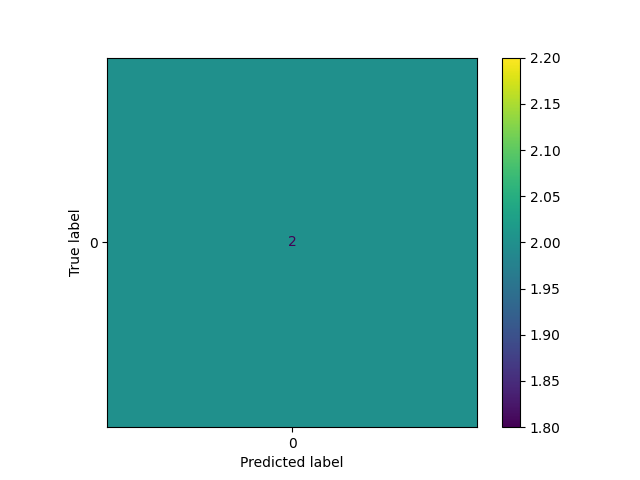

# AI-Powered Predictive Maintenance System 🚀

## 📌 Overview
This project uses Machine Learning to predict equipment failure based on sensor data such as temperature, pressure, and vibration.

## 🧠 Problem Statement
Industries face huge losses due to unexpected machine failures. This project helps predict failures in advance.

## 🏭 Industry Use Cases
- Manufacturing Plants
- Automotive Industry
- Power Plants
- Aviation Systems

## ⚙️ Tech Stack
- Python
- Pandas
- NumPy
- Scikit-learn
- Matplotlib

## 📊 Dataset
Synthetic sensor dataset simulating:
- Temperature
- Pressure
- Vibration
- Failure (0 or 1)

## 🔄 Workflow
1. Data Loading
2. Preprocessing
3. Feature Selection
4. Model Training (Random Forest)
5. Prediction
6. Visualization

## ▶️ How to Run

```bash
venv\Scripts\activate
python main.py

## 🔍 Features
- Predict machine failure using Machine Learning  
- Accept manual sensor inputs (temperature, pressure, vibration)  
- Evaluate model performance using accuracy  
- Generate confusion matrix visualization  

---

## 📈 Output
- Displays prediction result:
  - ✅ Machine is Normal  
  - ⚠️ Machine Failure Likely  
- Shows confusion matrix graph  
- Saves graph as image file  

---

## 📊 Sample Output



## 💡 Future Improvements
- Deploy as web application (using Flask/Streamlit)  
- Use real-time IoT sensor data  
- Improve accuracy using advanced ML models  
- Add dashboard for monitoring